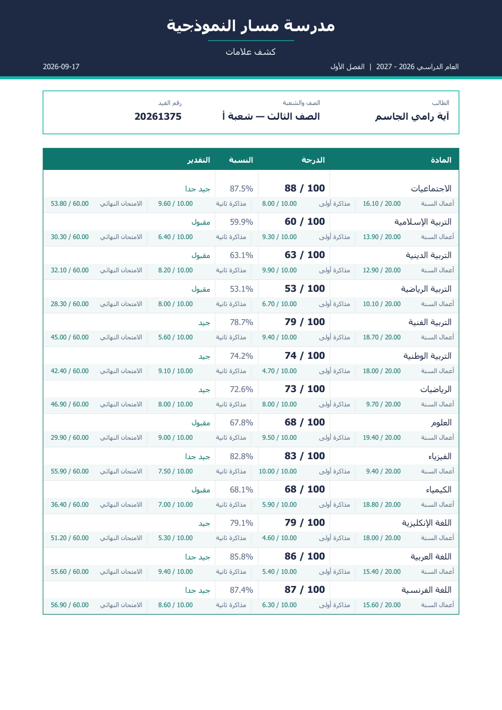
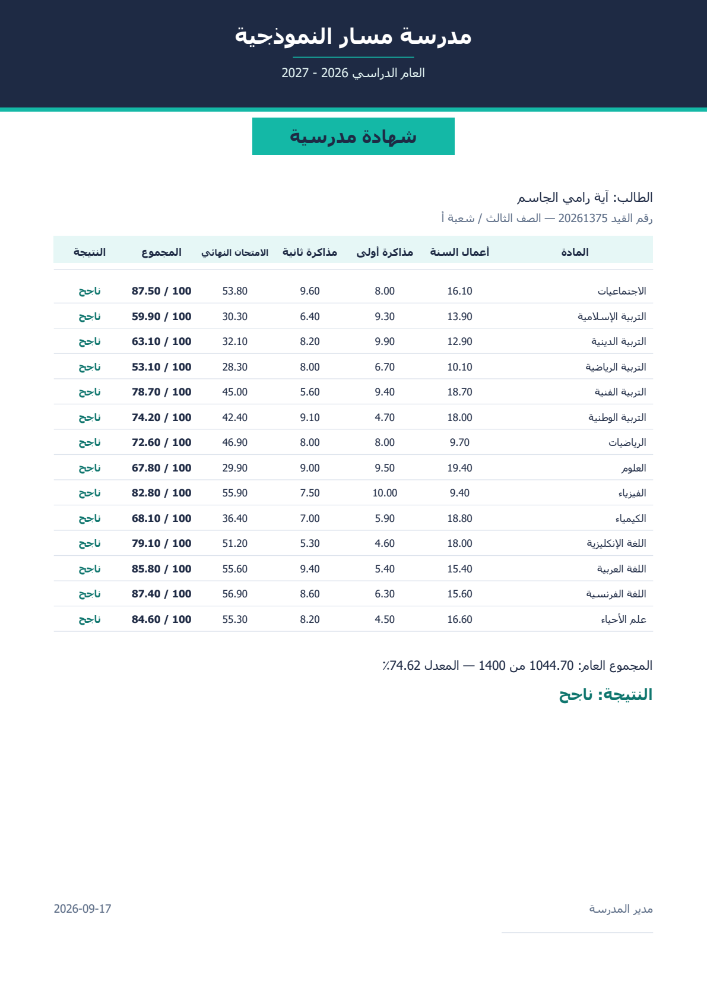
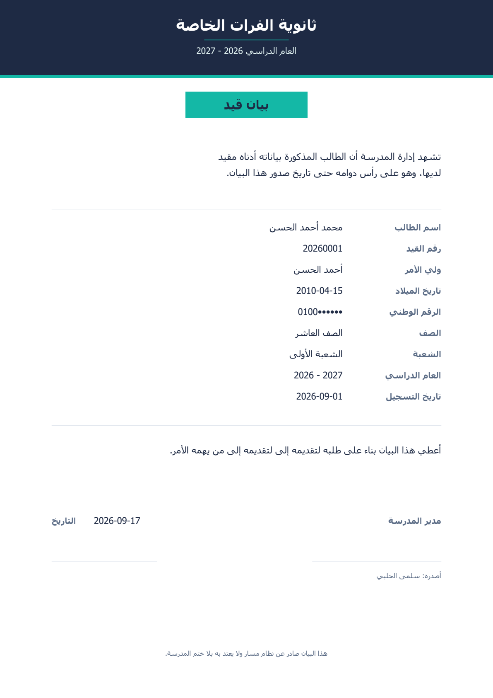
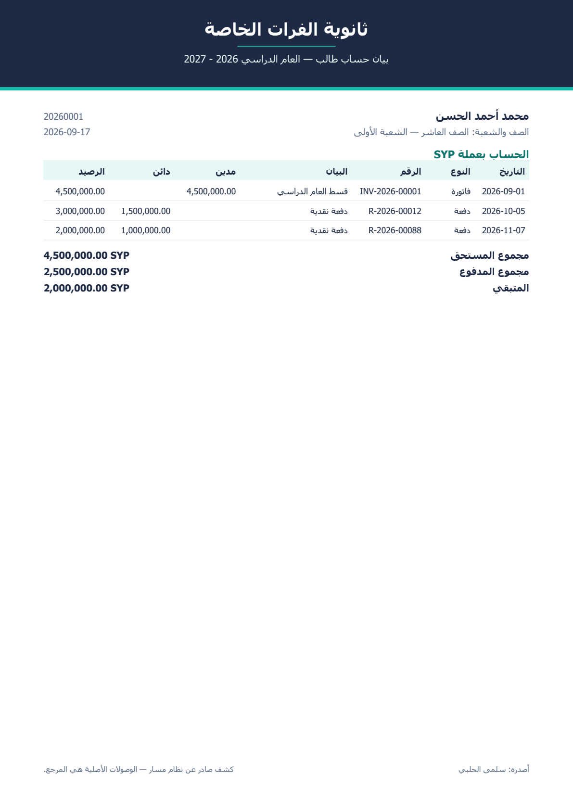
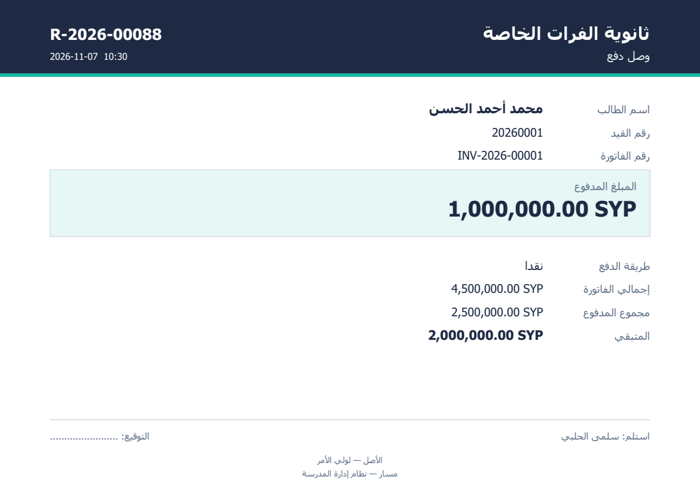
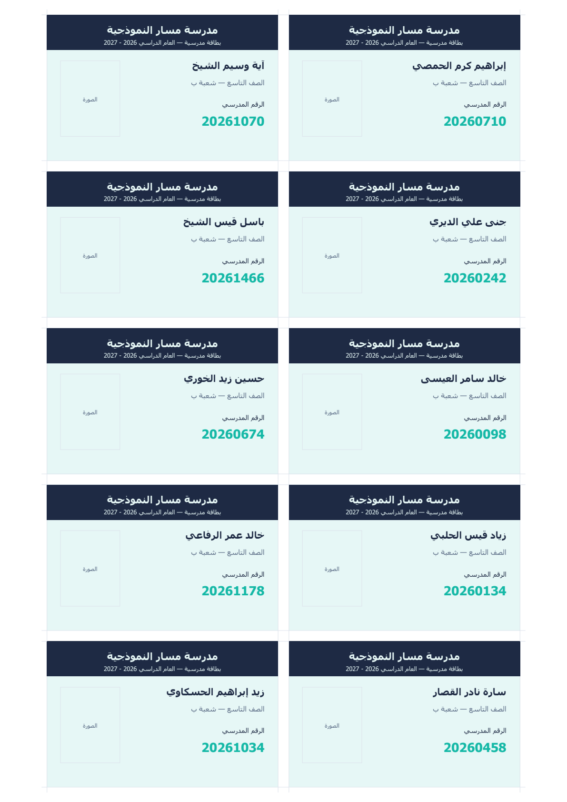

<div align="center">

# مَسار · Masar

**Offline-first school management system for Syrian schools**

**نظام إدارة مدرسة يعمل بلا إنترنت — للمدارس السورية**

**Proprietary Software · Portfolio Showcase · © 2026 Mohammed Yaman ALdous**

</div>

---

## Project at a glance

**Masar** is a desktop school-management system designed around a practical constraint: a school should be able to operate its core academic, attendance, financial, and administrative workflows without depending on reliable internet access or a continuously available external server.

The published GitHub repository is intentionally a **portfolio showcase**. It contains selected documentation, engineering records, and screenshots that demonstrate the product, architecture, security decisions, and validation work. The private application source code is **not included**.

### Product scope

Masar brings together:

- Student and class/section management
- Grades and grade components
- Attendance
- Student financial accounts, invoices, payments, and receipts
- Staff and payroll-related workflows
- Arabic document generation and school printing workflows
- Local school-network operation with an embedded/local database and server package
- Auditability and authorization controls designed for sensitive school data

The system is described in the project records as running in a real school environment, with the current documented release identified as **2.4.0**.

---

## Why this project matters

Masar was designed for schools where electricity interruptions, unreliable internet connectivity, and recurring software subscriptions are practical constraints rather than edge cases.

The architecture therefore follows an **offline-first / local-network** model: employee workstations communicate with a local school server, while the database and application services are packaged for local operation.

The project is deliberately grounded in workflows that school staff actually use: detailed grade sheets, attendance, statements, receipts, certificates, student cards, and account balances.

---

## Architecture

```text
┌──────────────────────────────────────────────────────────┐
│  Employee workstations                                  │
│  Flutter / Dart on Windows                              │
│  • Local school network                                 │
│  • Certificate pinning                                  │
└──────────────────────────┬───────────────────────────────┘
                           │ HTTPS
┌──────────────────────────┴───────────────────────────────┐
│  School server                                           │
│  • FastAPI                                               │
│  • Python 3.13                                           │
│  • SQLAlchemy 2.0 async                                  │
│  • ReportLab                                              │
│  • Arabic text shaping / bidi handling                    │
└──────────────────────────┬───────────────────────────────┘
                           │
┌──────────────────────────┴───────────────────────────────┐
│  Local database                                          │
│  PostgreSQL 16                                           │
│  Packaged for local school deployment                     │
└──────────────────────────────────────────────────────────┘
```

### Core technology stack

| Layer | Technology |
|---|---|
| Desktop UI | Flutter 3.44 · Dart |
| State / networking | Riverpod · Dio |
| Backend | FastAPI · Pydantic v2 · SQLAlchemy 2.0 async · asyncpg |
| Database | PostgreSQL 16 |
| Documents | ReportLab · `arabic-reshaper` · `python-bidi` |
| Windows distribution | Inno Setup |

---

## Engineering highlights

### Database-enforced integrity

Critical business rules are not left exclusively to the UI. The documented design places important constraints inside the database, including prevention of overpayment, payroll-contract conflicts, and invalid cross-section grade records.

### Tamper-evident audit trail

Changes are recorded in an audit chain linked by hashes. Database triggers and privileges are used to prevent ordinary application roles from rewriting or deleting audit history.

### Least-privilege role model

The documented security model separates database responsibilities across multiple roles and avoids connecting the application as a superuser. Schema upgrades use a separate elevated path rather than normal application privileges.

### Ownership-aware authorization

Authorization is designed around object ownership rather than role checks alone. The project records include a coverage test intended to detect endpoints that expose object identifiers without the corresponding ownership check.

### Arabic-first document generation

Arabic is treated as a first-class document-generation requirement: text shaping, bidirectional rendering, number alignment, Syrian-lira presentation, calendar handling, and A4/A5 print layouts are part of the implementation design rather than a translation layer.

### School-specific academic rules

The documented grade model supports component-based marks such as coursework, quizzes, and final exams, while preserving the way the school expects those values to appear on official paperwork.

---

## Validation evidence

The figures below are **documented project records** from the engineering log and review rounds included in this repository:

| Area | Documented result |
|---|---:|
| Server tests | **936** |
| UI tests | **311** |
| SQL behavioural tests | Passing |
| Minimum-privilege tests | **7 / 7** |
| Directed security attempts | **34 — blocked** |
| Endpoint verification | **174 responses, zero crashes** |
| Documented audit findings resolved | **100+** |

The detailed records show the issue, the observed failure, the correction, and the corresponding validation approach rather than presenting only a generic checklist.

---

## Examples of engineering work

The project history documents findings such as:

- **SEC-19 — Critical:** a lower-privileged school administrator path could take over a system-administrator account. The authorization chain was tightened and the full sequence was tested.
- **FIN-08 — Critical:** overdue-finance reporting missed invoices without installment plans. The reporting view was redesigned to include due unpaid invoices directly.
- **ACAD-31 — Critical:** attendance could be recorded against the calendar year while the grade sheet read a different “current” school year. The system now detects the mismatch and exposes an explicit blocking warning.
- **UX-35 — Critical:** report footers could collide with content on densely populated mark sheets. Layout reservation was changed to calculate the footer from its real required height and a range of subject-count tests was added.
- **OPS-20 — Critical:** a clean Windows machine could fail to start because required Visual C++ runtime DLLs were absent from the delivery package. The release process was changed to include and verify the required runtime components.

More examples are available in [`docs/engineering-log.md`](docs/engineering-log.md) and [`docs/review-rounds.md`](docs/review-rounds.md).

---

## Product output samples

### Grade report

A component-level marks report designed for the way parents and schools actually read grades.



### Annual certificate and enrolment certificate

 

### Finance: student statement and receipt

 

### Student cards



---

## Documentation

| Document | Purpose |
|---|---|
| [`docs/engineering-log.md`](docs/engineering-log.md) | Detailed engineering findings, fixes, and validation history |
| [`docs/review-rounds.md`](docs/review-rounds.md) | Structured review rounds covering engineering, security, UX, and operational concerns |
| [`OWNERSHIP.md`](OWNERSHIP.md) | Project ownership and rights declaration |
| [`LICENSE`](LICENSE) | Proprietary license — all rights reserved |
| [`THIRD-PARTY-NOTICES.md`](THIRD-PARTY-NOTICES.md) | Scope of third-party materials in this public showcase repository |

---

## Repository scope

This public repository is **not the application source repository**.

It intentionally publishes:

- Product documentation
- Engineering and review records
- Selected screenshots
- Ownership and licensing information

It intentionally does **not** publish:

- Application source code
- Database dumps or school records
- Credentials, certificates, keys, or environment secrets
- Deployment secrets or private operational configuration
- Third-party dependency binaries

The purpose is to give recruiters, companies, and reviewers a technically meaningful view of the project without publishing the proprietary implementation.

---

## Ownership & intellectual property

**Copyright holder / project owner:** Mohammed Yaman ALdous  
**Project:** Masar  
**Project year:** 2026  
**GitHub:** [@mohds-rgb](https://github.com/mohds-rgb)  
**Repository:** [mohds-rgb/MASAR](https://github.com/mohds-rgb/MASAR)

Masar and the original project materials presented in this repository are proprietary. No open-source license is granted for the project or its original materials.

The separate rights of third-party libraries, frameworks, fonts, icons, images, or other components remain with their respective owners where applicable. This showcase repository does not redistribute third-party dependency source code or binaries.

See [`OWNERSHIP.md`](OWNERSHIP.md) and [`LICENSE`](LICENSE) for the formal repository statements.

---

## Contributions

This is a proprietary portfolio repository. Public pull requests and community contributions are **not part of the project's licensing model**. Publication on GitHub is for portfolio presentation and does not grant permission to reuse the project.

---

## Contact

For professional or licensing enquiries, contact the project owner through the GitHub profile: [@mohds-rgb](https://github.com/mohds-rgb).

---

<div align="center">

**Masar · Mohammed Yaman ALdous · 2026**

</div>
